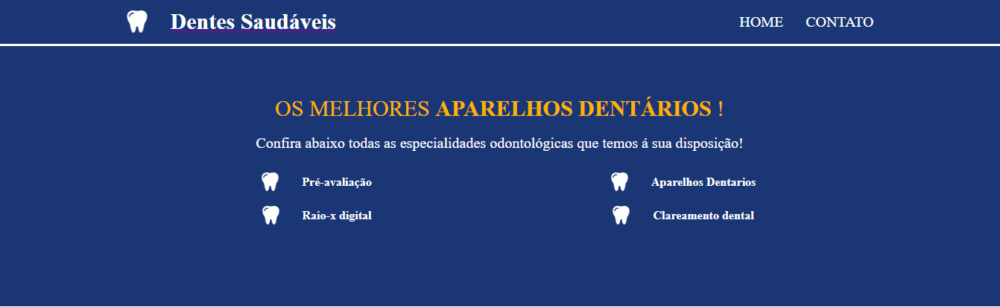
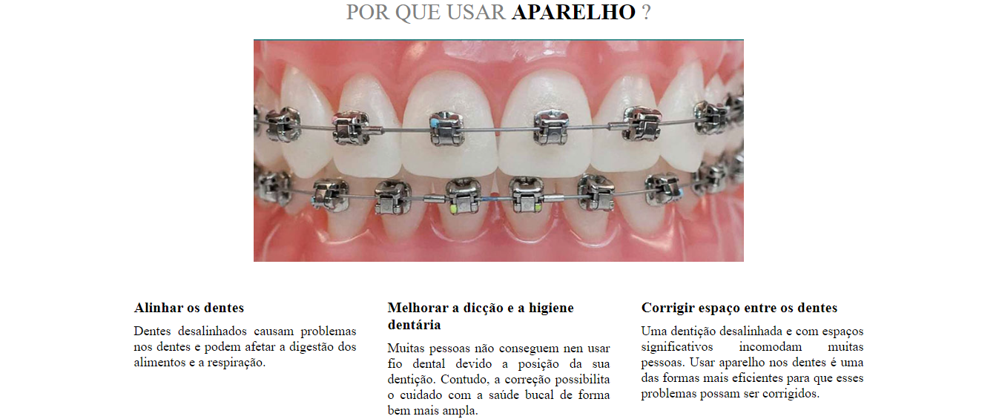
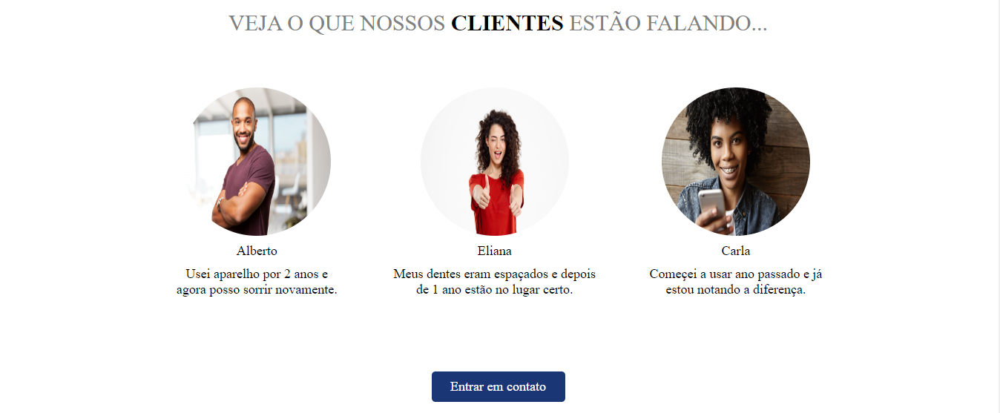
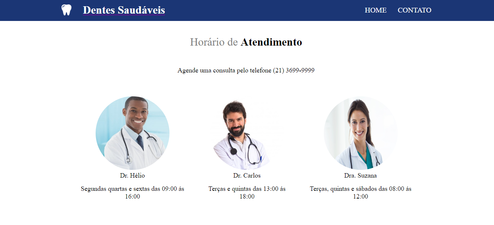
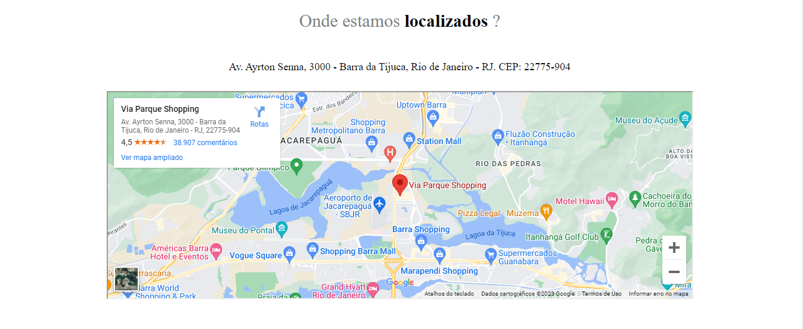

# Consultorio Dentes Saudaveis

## Pagina Web, de um consultorio de dentistas, na qual tem navegação entre as paginas utilizando React Router Dom e também aproveitando componentes utilizando Props.

## Tecnologia: Tecnologia: 

## Objetivo:
### - Criar uma pagina web 
### - Utilizar a biblioteca React Router Dom, para navegar entre paginas.
### - Passar e receber tags e componentes via Props.

## Oque Aprendi
### - Pude colocar em pratica os conhecimentos que ja tenho com React Router Dom.
### - Também praticar o uso de Props, para aproveitar componentes e tags.

### 
### 
### 
### 
### 